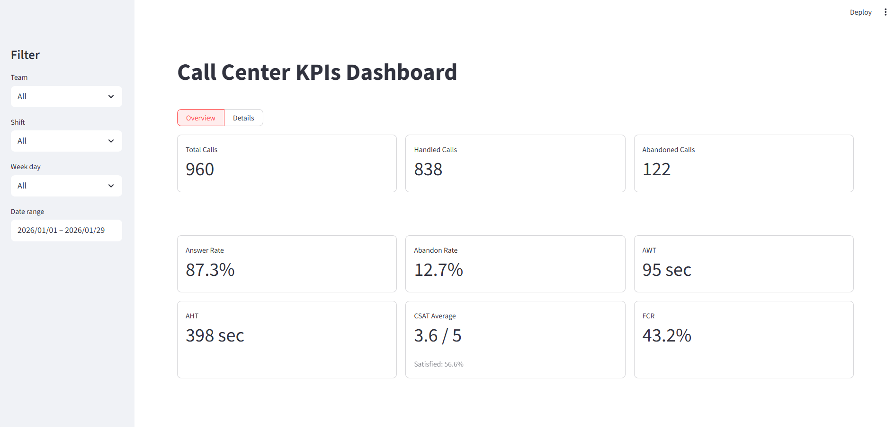
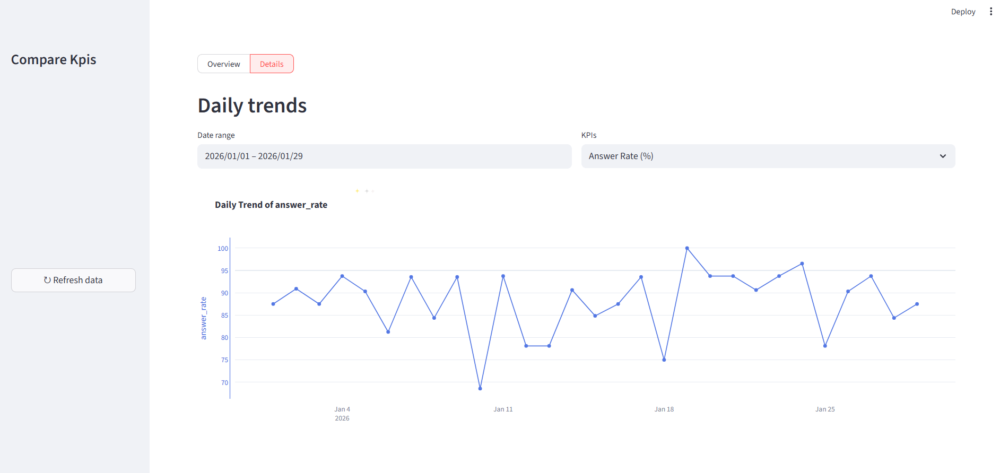
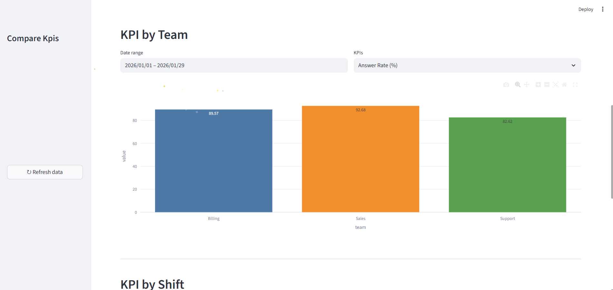

# Call Center KPI Dashboard

A simple data analysis and monitoring dashboard for evaluating call center performance across teams, shifts, dates, and call reasons.

## Overview

This project analyzes call center data and provides interactive KPI visualization through a FastAPI backend and Streamlit dashboard.

### Main KPIs

* Answer Rate
* Abandon Rate
* Average Wait Time (AWT)
* Average Handle Time (AHT)
* Customer Satisfaction (CSAT)
* First Contact Resolution (FCR)

## Project Structure

```text
Call Center/
│
├── data/
│   ├── raw/
│   └── preprocess/
│       └── clean_call_center.csv
│
├── notebook/
│   └── data_cleaning.ipynb
│
├── api/
│   ├── api.py
│   └── kpi.py
│
└── dashboard/
    └── app.py
```

## Architecture

```text
Raw Data
   ↓
Data Cleaning & Validation
   ↓
Clean Data
   ↓
KPI Calculation
   ↓
FastAPI
   ↓
Streamlit Dashboard
```

## Dashboard

### Overview



### KPI Comparison




## Features

* Data cleaning and validation
* KPI calculation based on business rules
* Filtering by date range, team, shift, and KPI
* Daily KPI trends
* Team performance comparison
* Shift performance comparison
* REST API using FastAPI
* Interactive visualization using Streamlit and Plotly

## Technologies

* Python
* Pandas
* NumPy
* FastAPI
* Streamlit
* Plotly
* Requests

## Running the Project

Install the required dependencies:

```bash
pip install -r requirements.txt
```

Run the FastAPI backend:

```bash
uvicorn api.api:app --reload
```

Run the Streamlit dashboard:

```bash
streamlit run dashboard/app.py
```

The API will be available at:

```text
http://127.0.0.1:8000
```

The dashboard will be available at:

```text
http://localhost:8501
```


